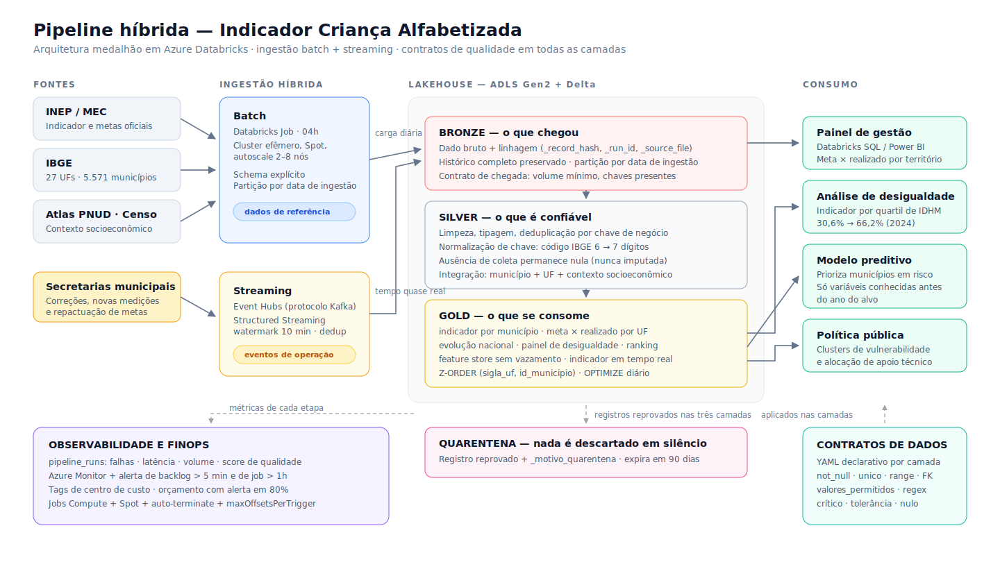
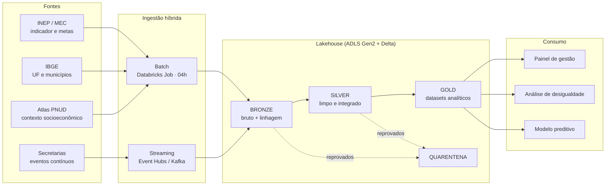

# Pipeline Híbrida para Análise da Alfabetização no Brasil

**Tech Challenge — Fase 2 · Pós Tech AI Scientist (FIAP)**

Pipeline de dados híbrida (batch + streaming) em arquitetura medalhão, construída sobre o
**Indicador Criança Alfabetizada** do INEP/MEC, com contratos de qualidade em todas as
camadas, observabilidade instrumentada e otimização de custo em nuvem.

<p align="center">
  
</p>

```bash
git clone https://github.com/m4ik-crtl/Fiap-tech-2.git && cd Fiap-tech-2
pip install -r requirements.txt
python -m src.pipeline --reprocessar      # roda tudo: raw -> bronze -> silver -> gold
```

> No Windows, o caminho mais previsível é `docker compose run --rm pipeline`.
> Passo a passo completo — inclusive publicação e Databricks — em
> **[`docs/guia_execucao.md`](docs/guia_execucao.md)**.

Sem editar caminho, sem baixar arquivo à parte, sem conta em nuvem. Os dados de entrada
estão versionados no repositório e todos os caminhos são relativos à raiz do projeto.

---

## Sumário

- [O problema](#o-problema)
- [O que a pipeline resolve](#o-que-a-pipeline-resolve)
- [Arquitetura](#arquitetura)
- [Fluxo de dados](#fluxo-de-dados)
- [Tecnologias e por que cada uma](#tecnologias-e-por-que-cada-uma)
- [Decisões arquiteturais e trade-offs](#decisões-arquiteturais-e-trade-offs)
- [Qualidade e governança de dados](#qualidade-e-governança-de-dados)
- [Monitoramento](#monitoramento)
- [FinOps — como a arquitetura foi otimizada](#finops--como-a-arquitetura-foi-otimizada)
- [Aplicação em IA](#aplicação-em-ia)
- [Como executar](#como-executar)
- [Estrutura do repositório](#estrutura-do-repositório)
- [Sobre os dados: o que é real e o que é reconstruído](#sobre-os-dados-o-que-é-real-e-o-que-é-reconstruído)

---

## O problema

O **Compromisso Nacional Criança Alfabetizada** mobiliza União, estados, Distrito Federal
e municípios em torno de uma meta única: garantir que toda criança brasileira esteja
alfabetizada ao final do **2º ano do ensino fundamental**.

Para medir isso, a Pesquisa Alfabetiza Brasil (INEP, 2023) definiu o **ponto de corte de
743 pontos na escala de proficiência do Saeb**. O percentual de estudantes que alcança
esse patamar é o **Indicador Criança Alfabetizada**. A trajetória pactuada leva o país a
**mais de 80% até 2030**.

O país avançou:

| Ano | Meta pactuada | Resultado | Situação |
|---|---|---|---|
| 2023 | — | **55,9%** | linha de base |
| 2024 | 59,9% | **59,2%** | 0,7 p.p. abaixo |
| 2025 | 64,0% | **66,0%** | **2,0 p.p. acima** |
| 2030 | 80,0% | — | meta final |

Mas a média nacional esconde o que importa. Em 2024, o **Ceará atingiu 85,3%** enquanto a
**Bahia ficou em 36,0%** — quase 50 pontos percentuais de diferença dentro do mesmo país.
E a desigualdade não é só entre estados: processando os dados municipais desta pipeline,
o indicador médio vai de **30,6%** no quartil de municípios com menor IDHM a **66,2%** no
quartil de maior IDHM.

Entender esse quadro exige o que uma planilha não faz: **integrar fontes heterogêneas** —
metas nacionais, estaduais e municipais, malha territorial, microdados educacionais e
contexto socioeconômico — com qualidade, escalabilidade e custo controlado.

## O que a pipeline resolve

| Pergunta de gestão | Tabela que responde |
|---|---|
| Quantas crianças não estão alfabetizadas, e onde? | `gold.indicador_alfabetizacao_municipio` |
| Cada estado está cumprindo a meta pactuada? | `gold.meta_vs_realizado_uf` |
| O Brasil está no ritmo de chegar a 2030? | `gold.evolucao_temporal_brasil` |
| A desigualdade educacional está diminuindo? | `gold.painel_desigualdade` |
| Onde o apoio técnico faz mais diferença? | `gold.ranking_municipios` |
| Quais municípios tendem a ficar abaixo da meta no ano que vem? | `gold.features_ml_municipio` |
| O indicador mudou nas últimas horas? | `gold.indicador_tempo_real` (streaming) |

---

## Arquitetura

A pipeline é **híbrida por necessidade**, não por enfeite. As fontes têm dois regimes
diferentes:

- **Batch** — malha do IBGE, contexto do Censo e resultados oficiais do INEP mudam uma vez
  por ano ou menos. Processar isso continuamente é pagar cluster para reler o mesmo arquivo.
- **Streaming** — secretarias municipais emitem correções, novas medições e repactuações
  o tempo todo. Esperar a carga noturna significa exibir número velho em painel de política
  pública.

As duas pernas escrevem nas **mesmas camadas**, com os **mesmos contratos**, e quem
consome não precisa saber de onde veio cada linha.



### As três camadas

**Bronze — o que chegou.** Dado bruto acrescido apenas de linhagem
(`_ingestion_timestamp`, `_source_file`, `_record_hash`, `_run_id`), particionado por data
de ingestão. Duas decisões importam: **schema explícito** (nunca `inferSchema` — schema
inferido muda quando o arquivo muda e quebra a pipeline em silêncio) e **histórico
completo preservado**, o que permite reprocessar exatamente o que existia em qualquer data.

**Silver — o que é confiável.** Limpeza de texto, tipagem, deduplicação por chave de
negócio, tratamento de ausentes, validação de consistência, **normalização de chaves** e
**integração das bases**. Um exemplo concreto: o Atlas do Desenvolvimento Humano publica o
código IBGE de município com **6 dígitos**; a malha territorial usa **7**. Sem normalizar,
o join devolve tudo nulo — sem erro, sem aviso. Foi exatamente o que aconteceu na primeira
execução deste projeto, e por isso a conversão virou etapa explícita e comentada.

Outra decisão da Silver: **não imputar o indicador ausente**. Roraima não teve coleta
divulgada em 2024; o valor permanece nulo com a flag `indicador_disponivel = false`.
Preencher com a média nacional produziria um número inventado num painel de política
pública.

**Gold — o que se consome.** Sete produtos analíticos com grão declarado e contrato
próprio (seis do batch, um do streaming). Destaque para `meta_vs_realizado_uf`, que publica
lado a lado o valor divulgado pelo INEP e o recalculado a partir dos municípios, com a
coluna `divergencia_pp`: uma **reconciliação explícita**, para que uma divergência futura
apareça na tabela em vez de aparecer numa reunião.

Detalhamento completo em **[`docs/arquitetura.md`](docs/arquitetura.md)** e
**[`docs/dicionario_dados.md`](docs/dicionario_dados.md)**.

---

## Fluxo de dados

### Batch

```
data/externo/*.csv               fontes públicas versionadas (IBGE, INEP, Atlas)
   │
   ▼ src/ingestao/preparar_raw.py
data/raw/*.csv                   as 6 entidades do desafio + _manifesto.json
   │
   ▼ [contrato bronze]           volume mínimo, chaves presentes
bronze/<entidade>                + linhagem, partição por data de ingestão
   │
   ▼ [contrato silver]           unicidade, integridade referencial, faixas, domínios
silver/<dim|fato>                limpo, tipado, integrado
   │
   ▼ [contrato gold]             grão único, status válido, alvo não nulo
gold/<produto analítico>         pronto para painel, análise e modelo
```

### Streaming

```
produtor de eventos ──▶ Kafka (local) / Event Hubs (nuvem)
   │
   ▼ bronze/eventos_stream        append bruto, checkpoint por consulta
   ▼ silver/eventos_stream        parse, validação, dedup por evento_id (watermark 10 min)
   ▼ gold/indicador_tempo_real    janelas de 5 min por UF, com latência medida
```

Três decisões de streaming que valem explicação:

- **Watermark de 10 minutos.** O produtor emite ~7% dos eventos com atraso deliberado de
  6 a 20 minutos. Sem watermark, eles cairiam na janela errada ou o estado cresceria para
  sempre.
- **Deduplicação por `evento_id`.** Kafka entrega *at least once*: evento repetido é a
  regra, não a exceção.
- **Um operador com estado por consulta.** Deduplicação e agregação por janela rodam em
  consultas separadas. Encadear as duas sobre o mesmo checkpoint é causa clássica de falha
  de state store — e foi o primeiro erro que este projeto encontrou ao subir o streaming.

---

## Tecnologias e por que cada uma

| Ferramenta | Papel | Por que esta |
|---|---|---|
| **Apache Spark 4 (PySpark)** | Engine de batch e streaming | Um único modelo de programação para os dois regimes; escala horizontal sem reescrever código |
| **Delta Lake** | Formato das tabelas | ACID (o painel nunca lê carga pela metade), time travel (auditar número divulgado meses atrás), `OPTIMIZE`/Z-ORDER |
| **Azure Databricks** | Plataforma em nuvem | Única oferta **first-party** de Databricks; Unity Catalog para governança; Photon e autoscale nativos |
| **Azure Event Hubs** | Mensageria | Fala **protocolo Kafka**: o mesmo código roda contra o broker local e contra a nuvem trocando só o endpoint |
| **Apache Kafka (Docker)** | Mensageria local | Paridade real com produção — não é mock |
| **ADLS Gen2** | Armazenamento | Namespace hierárquico, política de ciclo de vida, identidade gerenciada |
| **Terraform** | Infraestrutura como código | Ambiente reproduzível e revisável em pull request |
| **PyYAML** | Contratos de dados | Regra de qualidade legível por quem não programa |
| **pytest** | Testes | Trava de regressão, inclusive contra caminho absoluto |

### Por que Azure Databricks (e não AWS ou GCP)

O critério decisivo foi **paridade entre desenvolvimento e produção**. O Event Hubs aceita
clientes Kafka, então `spark.readStream.format("kafka")` é literalmente o mesmo código no
`docker compose` e na nuvem. Com Kinesis ou Pub/Sub, a perna de streaming exigiria um
conector diferente do usado em desenvolvimento — e código que só existe em produção é
código que ninguém testou. Análise completa das alternativas em
[ADR 0001](docs/adr/0001-nuvem-e-engine.md).

---

## Decisões arquiteturais e trade-offs

Cada decisão relevante está registrada como ADR:

| ADR | Decisão | Trade-off assumido |
|---|---|---|
| [0001](docs/adr/0001-nuvem-e-engine.md) | Azure Databricks | DBU custa mais que Glue em carga pequena — mitigado com Jobs Compute e Spot |
| [0002](docs/adr/0002-batch-vs-streaming.md) | Dado de referência é batch; evento de operação é streaming | Streaming responde por ~80% do custo mensal; é escolha consciente, reversível |
| [0003](docs/adr/0003-lakehouse-vs-datawarehouse.md) | Lakehouse, não data warehouse | Painel exige `OPTIMIZE` e cache que um DW daria de graça |
| [0004](docs/adr/0004-formato-e-particionamento.md) | Delta + partição por ano + Z-ORDER por UF | Particionar por município também criaria 16 mil diretórios minúsculos |
| [0005](docs/adr/0005-qualidade-e-quarentena.md) | Contratos declarativos com quarentena e tolerância | Cada check é uma passada a mais sobre o DataFrame |

### Batch vs streaming, na prática

| Fonte | Regime | Por quê |
|---|---|---|
| Malha de municípios e UFs | Batch anual | Município novo é evento raríssimo |
| Contexto socioeconômico | Batch decenal | O Censo é de 10 em 10 anos |
| Indicador e metas oficiais | Batch diário | Publicação anual, mas verificação diária capta correções |
| Correções municipais, novas medições, repactuações | **Streaming** | A gestão corrige hoje e precisa ver o efeito hoje |

---

## Qualidade e governança de dados

Nenhuma regra depende de alguém lembrar de conferir. Todas moram em
`config/contratos/{bronze,silver,gold}.yml` e são aplicadas pela mesma função em todas as
camadas.

```yaml
fato_indicador_municipio:
  descricao: "Indicador Criança Alfabetizada por município e ano"
  checks:
    - { tipo: unico, colunas: [ano, id_municipio], critico: true }
    - { tipo: range, coluna: indicador_pct, valor: [0, 100], critico: true }
    - { tipo: chave_estrangeira, coluna: id_municipio, referencia: dim_municipio, critico: true }
```

| Verificação exigida pelo desafio | Como é implementada |
|---|---|
| Verificação de duplicidade | `unico` sobre o grão declarado + deduplicação na Silver |
| Detecção de valores ausentes | `not_null` (string vazia também reprova) + `permite_nulo` por campo |
| Validação de chaves de relacionamento | `chave_estrangeira` com anti-join contra a dimensão |
| Consistência entre tabelas | Reconciliação municipal × publicado em `meta_vs_realizado_uf` |

**Três propriedades por check:** `critico` (isola o registro), `tolerancia_pct` (fração
aceitável antes de derrubar o job) e `permite_nulo`. A tolerância existe porque meia dúzia
de alunos sem resultado de prova não pode parar a apuração de um país inteiro — mas 10%
deles, sim.

**Quarentena, não descarte.** Registro reprovado vai para `_quarentena/<camada>/<tabela>`
com a coluna `_motivo_quarentena` listando as regras violadas. Nada some em silêncio.

> **O detalhe que quase passou:** predicado com valor nulo retorna `NULL`, não `false`.
> Numa implementação ingênua, `filter(cond)` e `filter(~cond)` **ambos** excluem a linha
> nula, e o registro desaparece dos dois lados sem erro. Todo predicado é envolvido em
> `coalesce(cond, false)`, e há um teste dedicado: `válidos + quarentena == entrada`.

Detalhes em **[`docs/governanca_qualidade.md`](docs/governanca_qualidade.md)**.

---

## Monitoramento

| Métrica exigida | Onde aparece |
|---|---|
| **Falhas de ingestão** | `status = ERRO` + mensagem; alerta na hora |
| **Latência do pipeline** | `duracao_s` por etapa (batch) e `latencia_s` por evento (streaming) |
| **Volume processado** | `registros_entrada`, `registros_saida`, `bytes_escritos` por tabela |
| **Alertas de erro** | Log ERROR sempre; webhook (Teams/Slack) se `ALERTA_WEBHOOK` estiver definido |

Cada etapa grava um evento em `data/_observabilidade/<run_id>.jsonl` e na tabela
`_observabilidade/pipeline_runs` — que vira série histórica. `make relatorio` produz:

```
| Camada | Tabela                   | Status | Entrada | Saída  | Quarentena | Qualidade | Duração |
|--------|--------------------------|--------|--------:|-------:|-----------:|----------:|--------:|
| silver | dim_municipio            | OK     |   5.571 |  5.571 |          0 |    100,0% |   6,11s |
| silver | fato_aluno               | OK     |  60.000 | 59.945 |         55 |    100,0% |   7,28s |
| gold   | indicador_..._municipio  | OK     |  16.713 | 16.713 |          0 |    100,0% |   4,63s |
```

Em produção, `LOG_FORMATO=json` alimenta o Log Analytics, e os jobs Databricks já trazem
regras de saúde: job batch acima de 1h e backlog de streaming acima de 5 minutos disparam
alerta. Detalhes em **[`docs/monitoramento.md`](docs/monitoramento.md)**.

---

## FinOps — como a arquitetura foi otimizada

Em nuvem, arquitetura é orçamento. **Sete decisões** reduzem custo:

| Decisão | Efeito |
|---|---|
| **Jobs Compute** em vez de All-Purpose | DBU ~3,7x mais barata para carga agendada |
| **Cluster efêmero** com auto-terminate | Zero custo entre execuções |
| **Instâncias Spot** nos executores (driver sob demanda) | Até 60% de desconto na VM, com fallback automático |
| **Parquet/Delta + Snappy**, partição por ano, Z-ORDER por UF | Consulta lê fração dos arquivos; custo é proporcional a bytes lidos |
| **`OPTIMIZE` diário + `VACUUM`** | Compacta o que o streaming fragmenta; devolve armazenamento antigo |
| **`maxOffsetsPerTrigger`** no streaming | Pico de eventos vira mais microlotes, não cluster maior |
| **Ciclo de vida do storage** | Bronze vai para Cool aos 30 dias, Archive aos 180 |

E o que foi **deliberadamente evitado**: particionar por município além do ano. Com 5.570
municípios × 3 anos seriam mais de 16 mil diretórios de poucos KB — o *small files
problem*, em que listar arquivos custa mais que ler dados.

### Estimativa de custo

Calculada a partir do que a execução local realmente produziu (volume, duração, registros),
não de um número escrito à mão:

| Cenário | Armazenamento | Batch | Streaming | Event Hubs | **Total/mês** |
|---|---:|---:|---:|---:|---:|
| Piloto (uma UF) | US$ 0,00 | US$ 3,52 | US$ 59,04 | US$ 21,90 | **US$ 84,47** |
| Produção nacional | US$ 0,02 | US$ 70,47 | US$ 354,24 | US$ 21,90 | **US$ 446,63** |
| Pico de divulgação | US$ 0,04 | US$ 676,49 | US$ 354,24 | US$ 43,80 | **US$ 1.074,58** |

Regenerar: `make custos`. Premissas de preço em `config/pipeline.yml`.

**Onde o dinheiro vai:** o streaming responde por ~80% do custo em produção — cluster
contínuo é sempre o item mais caro de uma arquitetura híbrida. Se atualização em minutos
deixasse de ser requisito, trocar o job contínuo por micro-batch de hora em hora cortaria
cerca de 70% da conta. O armazenamento, em contraste, é irrisório: o dado do país inteiro
cabe em poucos GB. Por isso o esforço de otimização está em **computação**, não em disco.

Detalhes em **[`docs/finops.md`](docs/finops.md)** e
[`docs/estimativa_custos.md`](docs/estimativa_custos.md).

---

## Aplicação em IA

A camada Gold entrega `features_ml_municipio`, uma feature store com grão declarado
(ano × município) — e uma trava que é o coração desta seção.

### Prevenção de vazamento (data leakage)

O indicador **é** `alunos_alfabetizados / matriculas_avaliadas × 100`. Um modelo treinado
com essas duas colunas não aprende nada sobre alfabetização: redescobre uma divisão.

O notebook [`04_aplicacao_em_ia.ipynb`](notebooks/04_aplicacao_em_ia.ipynb) demonstra
isso com números:

| Modelo | Features | R² | MAE |
|---|---|---:|---:|
| **Com vazamento** | `alunos_alfabetizados`, `matriculas_avaliadas` | **0,95** | 2,8 p.p. |
| Honesto — Gradient Boosting | contexto socioeconômico + indicador t−1 + meta | 0,75 | 7,0 p.p. |
| Honesto — Ridge | idem | 0,74 | 7,3 p.p. |
| Baseline (repete t−1) | — | 0,67 | 8,3 p.p. |

O modelo vazado parece melhor e **não serve para nada**: no momento em que a predição
seria útil — antes da avaliação do ano — nenhuma das duas colunas existe.

Por isso a trava é **código, não recomendação**:

```python
FEATURES_VETADAS = ["alunos_alfabetizados", "matriculas_avaliadas",
                    "indicador_uf_pct", "gap_meta_pp"]

vazadas = [c for c in FEATURES_VETADAS if c in df.columns]
if vazadas:
    raise RuntimeError(f"Vazamento detectado na feature store: {vazadas}.")
```

A validação também é **temporal** (treina em 2024, testa em 2025), não aleatória:
embaralhar anos deixaria o modelo ver o futuro do próprio município.

### Os três usos que o desafio pede

**a) Predição de alfabetização por município.** O modelo aponta, antes da avaliação, quais
municípios tendem a ficar abaixo da meta — o que transforma a política de reativa em
preventiva: o apoio chega no começo do ano letivo, não no relatório do ano seguinte.

**b) Análise de desigualdade educacional.** `gold.painel_desigualdade` cruza indicador,
região e quartil de IDHM. O resultado processado: **30,6%** no quartil de menor IDHM contra
**66,2%** no de maior — mais de 30 pontos percentuais associados ao território de nascimento.

**c) Política pública baseada em dados.** Nos 1.399 municípios do quartil de menor IDHM há
**259 mil crianças** não alfabetizadas. Se avançassem no ritmo nacional de 2023→2024
(+3,3 p.p.), seriam **~13 mil crianças alfabetizadas a mais em um ano**. É esse tipo de
simulação que a camada Gold torna possível em uma consulta.

---

## Como executar

### Opção 1 — Python local

```bash
pip install -r requirements.txt          # requer Java 17 ou 21 no PATH
python -m src.pipeline --reprocessar     # raw -> bronze -> silver -> gold
```

### Opção 2 — Docker (Kafka real)

```bash
docker compose run --rm pipeline              # batch completo
docker compose --profile streaming up         # Kafka + produtor + consumidor
docker compose --profile notebooks up jupyter # notebooks em localhost:8888
```

### Opção 3 — Streaming sem Docker

```bash
FONTE_STREAM=arquivo python -m src.ingestao.produtor_eventos --eventos 500
FONTE_STREAM=arquivo python -m src.pipeline --etapas streaming
```

O projeto degrada com elegância: se o jar do Delta ou do conector Kafka não puder ser
resolvido (ambiente sem acesso a repositório Maven), a sessão cai automaticamente para
Parquet e para o *file source* do Structured Streaming, **registra o downgrade no log** e
segue. A semântica do pipeline é a mesma; no Docker e no Databricks os jars resolvem e o
formato volta a ser Delta.

### Atalhos

```bash
make ajuda        # lista tudo
make batch        # pipeline batch
make tudo         # batch + eventos + streaming + relatório
make testes       # suíte pytest
make custos       # regenera a estimativa de custo
make limpar       # apaga lakehouse, checkpoints e observabilidade
```

Guia detalhado (Windows, Docker, WSL2, GitHub e Databricks):
**[`docs/guia_execucao.md`](docs/guia_execucao.md)**.

### Notebooks

| Notebook | O que faz |
|---|---|
| [`01_entendimento_fontes`](notebooks/01_entendimento_fontes.ipynb) | Problema, fontes, proveniência e defeitos dos dados |
| [`02_pipeline_medalhao`](notebooks/02_pipeline_medalhao.ipynb) | **Executa** bronze → silver → gold e mostra a qualidade |
| [`03_camada_gold_analises`](notebooks/03_camada_gold_analises.ipynb) | Evolução, meta × realizado, desigualdade, ranking |
| [`04_aplicacao_em_ia`](notebooks/04_aplicacao_em_ia.ipynb) | Vazamento de dados, modelo honesto e usos em política pública |

Todos estão versionados **com as saídas executadas** — dá para ler os resultados sem rodar.

---

## Estrutura do repositório

```
tech-challenge-fase2/
├── README.md                     este documento
├── requirements.txt              dependências fixadas por versão
├── Makefile · docker-compose.yml · Dockerfile
├── config/
│   ├── pipeline.yml              caminhos, Spark, streaming, preços de FinOps
│   └── contratos/                contratos de dados por camada (bronze/silver/gold)
├── data/
│   ├── externo/                  snapshots das fontes públicas (versionados)
│   ├── raw/                      as 6 entidades do desafio + _manifesto.json
│   └── lakehouse/                bronze/silver/gold gerados (fora do Git)
├── src/
│   ├── config.py                 caminhos relativos à raiz do projeto
│   ├── spark_session.py          sessão + abstração Delta/Parquet
│   ├── pipeline.py               orquestrador (CLI)
│   ├── ingestao/                 fontes oficiais, camada raw, produtor de eventos
│   ├── camadas/                  bronze · silver · gold · streaming
│   ├── qualidade/                motor de contratos de dados
│   ├── observabilidade/          instrumentação e relatório
│   └── finops/                   estimativa de custo a partir de medições reais
├── cloud/azure/
│   ├── terraform/                ADLS, Databricks, Event Hubs, alertas, orçamento
│   └── databricks/               jobs batch e streaming + SQL de otimização
├── notebooks/                    4 notebooks executados, com saídas
├── docs/                         arquitetura, ADRs, governança, monitoramento, FinOps
├── tests/                        pytest (contratos, transformações, reprodutibilidade)
└── scripts/                      geração de dicionário e de notebooks
```

---

## Sobre os dados: o que é real e o que é reconstruído

Trabalhar com dado público exige dizer de onde veio cada número. `data/raw/_manifesto.json`
declara isso arquivo a arquivo, e o rótulo viaja com o dado até a Gold, nas colunas
`origem_indicador` e `origem_meta`.

| Fonte | Proveniência |
|---|---|
| UFs e municípios | **REAL** — malha territorial do IBGE (27 UFs, 5.571 municípios) |
| Contexto socioeconômico | **REAL** — Atlas do Desenvolvimento Humano (PNUD/Ipea/FJP), Censo 2010, 24 variáveis para 5.564 municípios |
| Série nacional do indicador | **REAL** — INEP/MEC (2023, 2024, 2025) |
| Indicador por UF | **REAL** — INEP/MEC (26 UFs em 2024; Roraima sem coleta divulgada) |
| Metas nacionais | **REAL** (2024, 2025, 2026, 2030) + interpolação declarada da trajetória oficial |
| Metas por UF e município | **DERIVADAS** pela regra de trajetória do Compromisso Nacional |
| Indicador por município | **SIMULADO CALIBRADO** |
| Microdados de aluno | **SIMULADO CALIBRADO** e pseudonimizado |

### Por que o grão municipal é simulado — e por que isso é honesto

O INEP publica o resultado municipal em consulta interativa, sem arquivo aberto. A
simulação **não é sorteio**:

1. cada município recebe um escore a partir das suas variáveis socioeconômicas **reais**
   (IDHM educação, % de crianças pobres, analfabetismo, atraso escolar);
2. o escore é reescalado iterativamente até que a **média ponderada por matrículas de cada
   UF reproduza o valor real publicado pelo INEP** para aquela UF;
3. a proficiência de cada aluno é amostrada de modo que `P(proficiência ≥ 743)` reproduza
   o indicador do seu município.

O resultado é **verificável**: a coluna `divergencia_pp` de `gold.meta_vs_realizado_uf`
mostra **0,0 p.p.** entre o agregado municipal e o publicado pelo INEP em 2024. E o sinal
socioeconômico sobrevive: a correlação entre IDHM educação e o indicador municipal fica em
torno de **0,59**, na ordem de grandeza que a literatura observa.

Quando o INEP publicar o arquivo municipal, trocá-lo é substituir o CSV em `data/externo/`
— **a pipeline não muda**.

### Privacidade

Não há identificação de estudante: `id_aluno` é um SHA-256 truncado, não reversível,
gerado na origem. A camada Gold publica apenas agregados municipais. Na nuvem, o acesso ao
lake usa identidade gerenciada — não há credencial no repositório.

---

## Reprodutibilidade

Este projeto foi construído com três compromissos, verificados por teste automatizado:

1. **Nenhum caminho absoluto.** Tudo resolve a partir da raiz do repositório
   (`src/config.py`). Há um teste que varre `src/` e `config/` e falha se aparecer
   `C:\`, `/home/` ou `/Users/`.
2. **Dados de entrada versionados.** Os sete CSVs de `data/raw/` estão no repositório —
   ninguém precisa caçar arquivo para rodar.
3. **Dependências fixadas.** `requirements.txt` com versão exata de cada pacote.

```bash
make testes     # 26 testes: contratos, transformações, streaming, reprodutibilidade
```

---

## Fontes

- INEP/MEC — [Avaliação da Alfabetização · resultados](https://www.gov.br/inep/pt-br/areas-de-atuacao/avaliacao-e-exames-educacionais/avaliacao-da-alfabetizacao/resultados)
- INEP — [Indicador Criança Alfabetizada por município](https://www.gov.br/inep/pt-br/centrais-de-conteudo/noticias/avaliacao-da-alfabetizacao/inep-divulga-dados-do-indicador-crianca-alfabetizada-por-municipio)
- Base dos Dados — [Avaliação da Alfabetização](https://basedosdados.org/dataset/073a39d4-89cf-4068-b1e8-34ed0d9c0b72)
- Todos Pela Educação — [Análise do Indicador Criança Alfabetizada 2023](https://todospelaeducacao.org.br/noticias/analise-do-todos-pela-educacao-sobre-a-divulgacao-do-indicador-crianca-alfabetizada/) · [2024](https://todospelaeducacao.org.br/noticias/analise-indicador-crianca-alfabetizada-de-2024/)
- Fundação Lemann — [O que o ICA 2025 revela sobre a alfabetização no Brasil](https://fundacaolemann.org.br/noticias/o-que-o-ica-2025-revela-sobre-a-alfabetizacao-no-brasil/)
- CNN Brasil — [Índices de alfabetização por estado, segundo o MEC](https://www.cnnbrasil.com.br/educacao/veja-os-indices-de-alfabetizacao-por-estado-segundo-mec/)
- IBGE — malha de municípios e unidades da federação
- PNUD/Ipea/FJP — Atlas do Desenvolvimento Humano no Brasil (Censo 2010)
