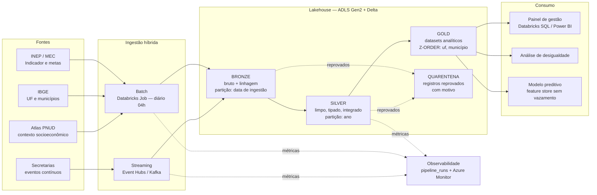

# Arquitetura da solução

## Visão geral

A pipeline é **híbrida** por necessidade, não por enfeite. As fontes do
Indicador Criança Alfabetizada têm dois regimes muito diferentes:

- **Batch** — a malha territorial do IBGE, o contexto socioeconômico do Censo e
  os resultados oficiais do INEP mudam **uma vez por ano** (ou menos). Rodar
  isso continuamente seria pagar cluster para reler o mesmo arquivo.
- **Streaming** — as secretarias municipais e os sistemas de avaliação emitem
  correções, novas medições e repactuações de meta **o tempo todo**. Esperar a
  carga noturna significa exibir número desatualizado em painel de política
  pública.

A arquitetura medalhão une os dois regimes: as duas pernas escrevem nas mesmas
camadas, com os mesmos contratos de qualidade, e o consumidor final não precisa
saber de onde veio cada linha.



## As camadas

### Bronze — o que chegou

Guarda o dado **como veio**, acrescido apenas de metadados de linhagem
(`_ingestion_timestamp`, `_source_file`, `_record_hash`, `_run_id`). Duas
decisões importam aqui:

1. **Schema explícito, nunca `inferSchema`.** Schema inferido muda quando o
   arquivo muda — e a pipeline quebra em silêncio, ou pior, converte tipo errado
   sem avisar. Com schema declarado (`src/camadas/bronze.py`), uma mudança de
   layout na origem aparece imediatamente como coluna nula, não como número
   errado no painel.
2. **Partição por data de ingestão.** Preserva o histórico completo: dá para
   reprocessar exatamente o que existia em qualquer data, que é o que permite
   auditar um número divulgado seis meses atrás.

### Silver — o que é confiável

É onde a base fica utilizável e, principalmente, onde as fontes se **integram**:

| Transformação | Exemplo concreto neste projeto |
|---|---|
| Limpeza de texto | `"  BELÉM  "` → `"Belém"`; `"centro-oeste"` → `"Centro-Oeste"` |
| Normalização de chave | Atlas publica código IBGE de **6** dígitos, a malha usa **7** — sem conversão, o join devolve tudo nulo em silêncio |
| Deduplicação | Uma linha por chave de negócio, mantendo a ingestão mais recente |
| Tipagem | Percentuais como `double`, códigos territoriais como `long` |
| Valores ausentes | Roraima não teve coleta divulgada em 2024: o valor **continua nulo** e ganha a flag `indicador_disponivel` |
| Consistência entre colunas | `alunos_alfabetizados` nunca pode exceder `matriculas_avaliadas` |
| Integração | município + UF + contexto socioeconômico em uma dimensão só |

Sobre valores ausentes vale um parágrafo: a tentação é imputar a média. Num
indicador de política pública, imputar é fabricar. Ausência de coleta é
informação — e some do painel se for preenchida com a média nacional.

### Gold — o que se consome

Seis produtos analíticos, cada um com grão declarado e contrato próprio:

| Tabela | Grão | Para quê |
|---|---|---|
| `indicador_alfabetizacao_municipio` | ano × município | Painel principal, com meta, gap, ranking e contexto |
| `meta_vs_realizado_uf` | ano × UF | Acompanhamento da pactuação, com reconciliação |
| `evolucao_temporal_brasil` | ano | Série histórica e distância da meta de 2030 |
| `painel_desigualdade` | ano × região × quartil de IDHM | Análise de desigualdade educacional |
| `ranking_municipios` | ano × município (extremos) | Priorização de apoio técnico |
| `features_ml_municipio` | ano × município | Treino de modelo preditivo |

A tabela `meta_vs_realizado_uf` merece destaque: ela publica lado a lado o
`indicador_publicado_pct` (o que o INEP divulgou) e o `indicador_calculado_pct`
(o que resulta de agregar os municípios), com a coluna `divergencia_pp`. É uma
**reconciliação explícita** — se um dia a divergência crescer, o problema
aparece na tabela em vez de aparecer numa reunião.

## Fluxo de dados fim a fim

```
data/externo/*.csv            fontes públicas versionadas no repositório
        |
        v
src/ingestao/preparar_raw.py  monta as 6 entidades do desafio + manifesto
        |
        v
data/raw/*.csv                entrada da pipeline (versionada)
        |
        v  [contrato bronze]   volume mínimo, chaves presentes
bronze/<entidade>             + linhagem, particionado por data de ingestão
        |
        v  [contrato silver]   unicidade, FK, faixas, domínio de valores
silver/<dim|fato>             limpo, tipado, integrado
        |
        v  [contrato gold]     grão único, status válido, alvo não nulo
gold/<produto analítico>      pronto para painel, análise e modelo
```

Em paralelo, a perna streaming:

```
produtor de eventos --> Kafka / Event Hubs
        |
        v
bronze/eventos_stream    append bruto, checkpoint por consulta
        |
        v
silver/eventos_stream    parse, validação, dedup por evento_id (watermark 10 min)
        |
        v
gold/indicador_tempo_real  janelas de 5 min por UF, com latência medida
```

## Trade-offs assumidos

Cada decisão relevante está registrada como ADR em [`docs/adr/`](adr/):

| ADR | Decisão |
|---|---|
| [0001](adr/0001-nuvem-e-engine.md) | Azure Databricks como nuvem e engine |
| [0002](adr/0002-batch-vs-streaming.md) | Onde usar batch e onde usar streaming |
| [0003](adr/0003-lakehouse-vs-datawarehouse.md) | Lakehouse em vez de data warehouse |
| [0004](adr/0004-formato-e-particionamento.md) | Delta, particionamento e custo por consulta |
| [0005](adr/0005-qualidade-e-quarentena.md) | Contratos declarativos, quarentena e tolerância |
